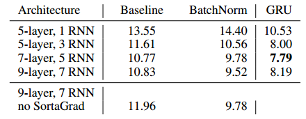

# DeepSpeech

## 一、架构

系统是一个循环神经网络(RNN)，具有一个或多个卷积输入层，随后是多个循环(单向或双向)层，在softmax层之前是一个完全连接层。

使用CTC损失函数对网络进行端到端训练，这使我们能够直接预测输入音频中的字符序列。

输入到网络中的数据是一系列对数谱图，这些对数谱图是通过对经过功率归一化处理的音频片段进行计算得到的，每个音频片段的长度为20毫秒。网络的输出是每种语言的字母表。这意味着网络的任务是识别和生成特定语言中的基本字符或符号。

在推理过程中，CTC 模型与一个在大规模文本语料库上训练的语言模型配对使用。我们采用一种由 Hannun 等人提出的专门的束搜索算法，来寻找使得目标函数最大的转录结果 `y`。通过这种方法，可以提高语音识别的准确性和流畅性:

在转录结果 $y$ 中，$wc(y)$ 表示单词或字符的数量。权重 $α$ 控制语言模型和 CTC 网络的相对贡献，权重 $\beta$ 鼓励转录结果中包含更多的单词或字符。这些参数在独立的开发集上进行调整，以优化模型的性能。

### 1.1 深度RNN网络的batch normalization（批归一化）

为了在扩大训练集时有效地利用数据，我们通过添加RNN层增加了网络的深度。但是随着网络大小和深度的增加，使用梯度下降也变得比较困难。
已经证实可以使用批归一化来更快地训练深度网络。最近的研究表明，BatchNorm可以加快RNN训练的收敛速度，尽管并不是总能改善泛化误差。
相比之下，我们发现在大数据集上使用非常深的RNN网络时，除加速训练外，我们使用BatchNorm的变种还大大改善了最终的泛化误差。

RNN的公式：

其中，在时间步$t$的$l$层的激活值是通过将同一时间步t的前一层$h_t^{l-1}$的激活值与在当前层的前一个时间步$t-1$的$h_{t-1}^l$的激活值相结合来计算的。

有两种方式可以将BatchNorm应用到RNN操作中。

一种方式是在每次非线性操作前加上一个BatchNorm的转换$B(.)$。

$h_t^l=f(B(W^lh_t^{l-1}+U^lh_{t-1}^l))$

在这种情况下，均值和方差统计是在小批量的单个时间步上累积的。这样没有什么效果。

另一种方法(顺序规范化)是只对垂直连接进行批处理规范化。公式为：

$h_t^l=f(B(W^lh_t^{l-1})+U^lh_{t-1}^l)$

对于每个隐藏单元，计算整个序列中minibatch中所有项的均值和方差。

### 1.2 SortaGrad

从头开始训练非常深的网络（或具有很多步的RNN）可能会在训练初期失败，因为输出和梯度必须经过许多未调好参数的网络层传播。除了梯度爆炸外，CTC经常将接近零的概率赋值给非常长的转录文本，从而造成梯度消失。

    表1:不同RNN深度、BatchNorm和SortaGrad的应用以及循环隐藏单元类型时，开发集上的WER(Word Error Rate)比较。

SortaGrad 是一种课程学习策略，通过先训练较短（较容易）的语句来提高训练的稳定性。在第一个训练轮次中，按照语句长度递增的顺序遍历小批次，然后在之后的轮次中恢复到随机顺序。实验结果表明，SortaGrad 能显著改善训练的稳定性，特别是在没有使用批量归一化的深层网络中。

### 1.3 频域卷积

时域卷积是语音识别中常用的一种方法，可以有效地对变长话语的时间翻译不变性进行建模。频域卷积试图比大型全连接网络更简洁地模拟由说话人变化引起的频谱方差。

添加一到三层卷积。这些都是在“时域和频域(2D)”和“时域(1D)”。在所有情况下，都使用“相同”的卷积。在某些情况下，在任意一个维度上指定一个步幅(子采样)，以减少输出的大小。

表2：不同配置下的WER比较。在所有情况下，卷积之后是7个循环层和1个完全连接层。对于二维卷积，第一维是频率，第二维是时间。

发现多层的一维卷积效果一般。2D卷积可显着改善嘈杂数据的结果，而对纯净数据却没有多少提升。从一层一维卷积到三层二维卷积的改变使噪声开发集上的WER提高了23.9％。

### 1.4 lookahead卷积和单向模型

双向RNN模型很难部署到实时、低延迟的环境中，因为当用户的声音到来时，它无法实现流式处理。
仅具有前向循环的模型通常比同类的双向模型性能差，这意味着一定数量的下文对于效果提升至关重要。
一种可能的解决方案是延迟系统产生预测结果的时间，直到它具有更多上下文为止，但很难在模型中实现这种行为。

为了构建一个没有损失精度的单向模型，方案开发了一种特殊的网络层，叫做lookahead convolution。

该层学习权重以线性组合每个神经元的激活时间步长$\tau$，从而使我们能够控制所需的下文的量。

lookahead由参数矩阵$W \in R^{(d,\tau)}$定义，其中d是上一层中的神经元数量。在时间步t对新层的激活$r_t$为:
$$
r_{t,i}=\sum_{j=1}^{\tau+1}W_{i,j}h_{t+j-1,i},\mathrm{for~1\leq i\leq d.}
$$
将lookahead卷积放在所有循环层之上。这使我们能够以更精细的粒度在lookahead卷积以下做流式计算。
