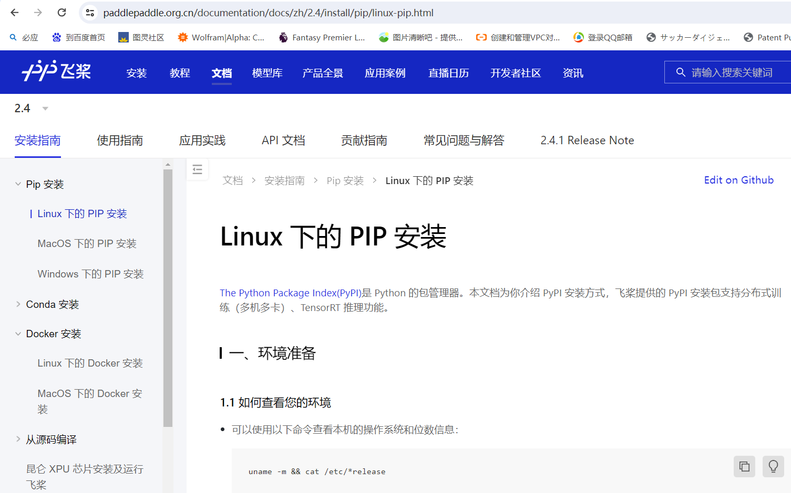

# PaddlePaddle-PaddleSpeech安装文档

## 要点

注意要paddlepaddle要小于2.5.1版本，python版本[3.8,3.10]

## 环境相关

### python升级和安装

https://blog.csdn.net/ThomasCai001/article/details/133964930

https://blog.csdn.net/weixin_44675033/article/details/134854960

### Cuda和Cudnn安装

https://www.gongsunqi.xyz/posts/3c995b2a/?highlight=wsl#%E9%85%8D%E7%BD%AEcudatoolkit%E5%92%8Ccudnn

https://blog.csdn.net/qq_40102732/article/details/135182310

### Docker容器使用GPU

https://blog.csdn.net/weixin_44966641/article/details/123760614

## Paddle安装要点

### PIP安装

#### 1 安装paddlepaddle

选择官网2.4版本，跟着教程走就行。

#### 2 paddlespeech安装

https://github.com/PaddlePaddle/PaddleSpeech/blob/develop/README_cn.md

跟着官方教程。

注意：pip install paddlespeech之后建议加上--no-deps，因为我们已经安装好了paddlepaddle2.4.2，如果直接pip install paddlespeech会默认重新安装2.5版本的paddlepaddle(虽然这样好像也没啥问题)，可以一步步的安装paddlespeech所需依赖。

### Docker安装（强推）

#### 1 使用过的方法

成功过，但升级笔记本CUDA后，docker容器一直用不上GPU，奇了怪了。

https://www.paddlepaddle.org.cn/documentation/docs/zh/2.4/install/docker/linux-docker.html

需要升级镜像中的python版本，再安装paddlespeech

容器中安装paddlespeech与官网相同。

#### 2 可以尝试的方法

直接在dockerhub上找已经继承paddlespeech的paddlepaddle镜像。

## 可能遇到的问题

no moudle named _bz

no moudle named lzma

[[问题汇总\]Python3解决ModuleNotFoundError: No module named ‘_bz2‘_python3 modulenotfounderror: no module named-CSDN博客](https://blog.csdn.net/claro/article/details/119409373)

像教程那样找到三个python文件夹，把so文件复制到文件夹里，重新configure python，make and make install

https://blog.csdn.net/Bolly_He/article/details/119750618

